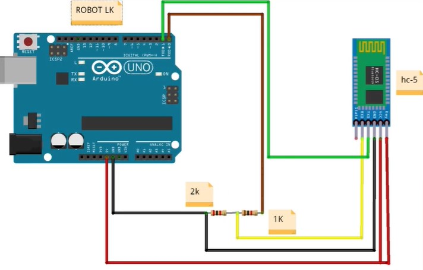

# Arduino Notes

Author: __*yufanana*__
 
____

### Miscellaneous Tips

Install custom driver for serial communicator (CH34x) if the Arduino is not genuine.

Under Tools > Processor, change to ATmega328 (old bootloader) if the upload takes very long or has errors.

## Bluetooth HC-05

### Setup for Master

In configuration, Rx -> Rx, Tx -> Tx.

HC-05 blinks every 2s when it is in AT mode.  
HC-05 blinks very quickly when it is in discovery mode.  
Rx pins takes 3.3V, so need a 3v3 zener diode or voltage divider to bring 5V -> 3.3V (level-shifter)  

If the BT module does not enter AT mode, pull out the power pin, press down the button, and reinsert the power pin.

- Upload a blank sketch.
- Open serial monitor.
- Select 38400 baud rate, Both NL & CR

__AT Commands__  
These commands are used to configure the communication module.  
Each command starts with AT (attention).  
Append a `?` to return the value/state.

- `AT+UART?`, check if output `=9600,0,0`
- If not, enter `AT+UART=9600,0,0`
- `AT+ROLE=0` to set the BT module as the slave
- `AT+ADDR?` to get the bluetooth address. Copy the output and save it.
    - e.g. 98D3:21:F76108

Remove the slave BT module, and insert the master BT module.

- `AT+UART=9600,0,0`
- `AT+ROLE=1` to set the BT module as the master
- `AT+CMODE=0` to configure the module to bind with the mac address only
- `AT+BIND='slave module address'`, changing the colons to commas
    - e.g. 98D3,21,F76108

### Additional AT Commands

`AT+NAME=MODULE_NAME` to set the name

`AT+ORGL` for factory reset

`AT+RMAAD` to remove previous linked connections

`AT+PSWD` to return the password

