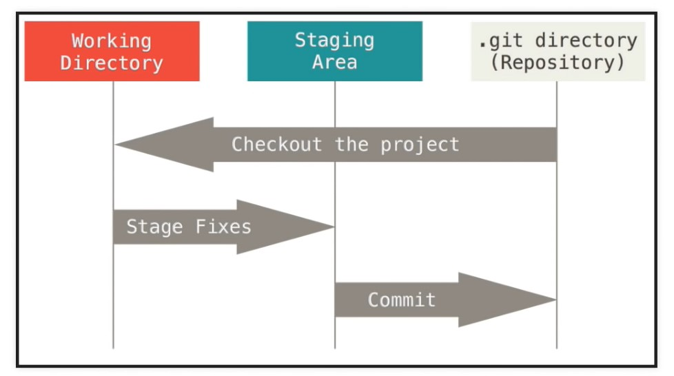

# Git Notes

Author: __*yufanana*__
</br>
____

## General
`git <verb>` <br>
`git <verb> --help` get documentation about \<verb>. <br>
`touch <file_name>` creates the specified file. <br>



## Set Config Values
Think of this as logging into your GitHub account. <br>
`git config --list` lists all variables set in the config file. <br>
`git config --global user.name 'yufan-fong'` <br>
`git config --global user.email 'yufan.fong@gmail.com'` <br>

## Create New Repository
Go to GitHub web and create a new repositary there. <br>
Follow the instructions there to add origin.

## Git Ignore
`touch .gitignore` to create the *gitignore* text. </br>
Write the names of the files for *git* to ignore inside the *gitignore* file.

Can add a folder directory into `.gitignore` as `/<folder directory>`

`*.txt` to include all *.txt* files inside `.gitignore`.

## Procedure for Local to Remote Repo
`git init` initialises an empty git repo, creates *.git* file. <br>
`git status` lists which files are staged, unstaged, modified. <br>

`git add <file_name>` adds the specified file to the staging area. <br>
`git add .` adds all the files in the folder to the staging area. Synonymous with `git stage`.

`git reset <file_name>` removes file from the staging area. <br>
`git reset` removes everything from the staging area. <br>
`git reset --soft HEAD~1` to remove everything from the commit into the staging area.

`git commit -m "Added new section"` commits to the branch. <br>
`git log` shows the commits just made. <br>
`git push` pushes to the remote repo. <br>

## Procedure from new local Repo to Remote Repo

First, create a new repo on GitHub without any README, license or gitignore files.

```
git init -b main
git add .
git commit -m "Initial commit"
git remote set-url origin https://github.com/username/repository.git
git push -u origin main
```

## Procedure for Remote to Local Repo
`git clone <url> <destination_dir>` make a copy of it at the specified local directory. <br>
Use `.` to refer to the current directory.

### View information about remote repo
`git remote -v` view the remote repo. <br>
`git branch -a` view all the branches. <br>

## Pushing changes
`git diff` shows the changes made. <br>
then the usual `git add`, `git commit`.

`git pull origin master` pull any changes made to the repo since the last time it was pulled. <br>
`git push origin master` push our changes <br>
`origin`: name of remote repo <br>
`master`: branch name

## Create a branch for desired feature
`git branch <branch_name>` creates a new branch with the specified name. <br>
`git branch` lists all the local branches, and * the active branch. <br>
`git branch -a` <br>
`git checkout <branch_name>` to change to the specified branch.

Any commits to the local branch has no effect on local master branch or remote repo. Should perform the below:

`git push -u origin <branch_name>` pushes specified local branch to the remote repo.

## Merge a branch
`git checkout master` change to work on the master branch. <br>
`git pull origin master` <br>
`git branch --merged` shows the branches that have been merged so far. <br>
`git merge <branch_name>` merges the specified branch to the active branch, which is master in this case. <br>
`git push origin master` <br>

Once merge is successful, <br>
`git branch -d <branch_name>` to delete branch locally. <br>
`git push origin --delete <branch_name>` to delete branch in remote repo. <br>

## Submodules
A Git repo inside another git repo.<br>
`git submodule add <url> ` to add the repo as a submodule to the local repo. <br>
It clones the current version/commit of the git repo. <br>

## Misc
*Esc* + `:wq` <br>
`git remote add <repo_name> <url>` creates a new connection to the remote repo. <br>
`git remote set-url origin <url>` to change the Git origin remote. <br>

