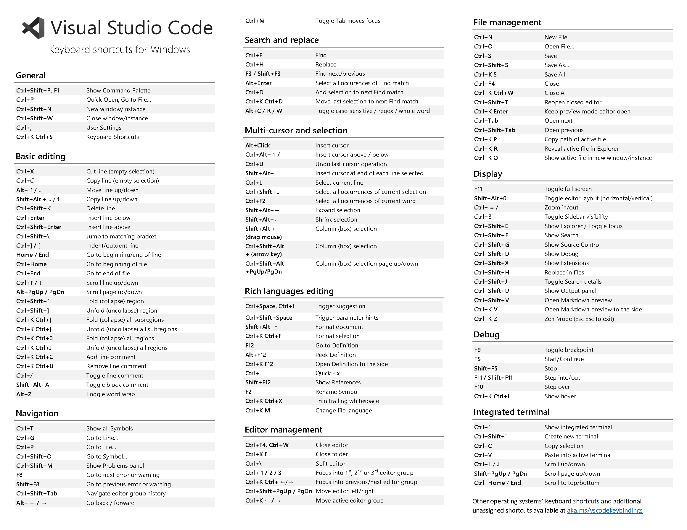

Summary of keyboard shortcuts for Visual Studio Code to improve productivity 

*Rely more on keyboard instead of the mouse to be quicker.*

## General
`Ctrl + P`: command palette  
By default, it shows a list of recently opened files  

Type `>` to access to all the VSC commands  
Type `@` to view all the symbols used in the file  
Type `#` for the global symbol search  
OR `Ctrl + Shift + .` to view all the symbols used in the file

## Navigation
`Ctrl + G` to go the code line  
`Ctrl + D` to select all occurrences of the current word. Use Ctrl+D again to edit all occurrences simultaneously.  

## Basic Editing
`Alt + Up/Down` to move the line up/down  
`Ctrl + X` to cut the selected line  
`Ctrl + C` to copy the selected line  
`Alt + Shift + Up/Down` to cope line up/down multiple times  

`Ctrl + /` to toggle line comment  
`Shift + Alt + A` to toggle block comment  

## Multi-cursor and selection
`Alt + Click` to insert cursor  
`Ctrl + U` to undo last cursor operation  
`Ctrl + L` to select current line  
`Ctrl + F2` to select all occurrences of current word  

## File Management
`Ctrl + N` to create new file  
`Ctrl + Tab` to open the next tab  
`Ctrl + Shif + Tab` to open the previous tab  
`Ctrl + W` to close editor  

## Debug
`F9` to insert toggle breakpoint  
`F5` to start/continue  
`Shift + F5` to stop.  

## Terminal
``Ctrl + ` `` to toggle terminal  
`Ctrl + K` to clear terminal  

In the command palette,  
`>task` to configure build task.  
`>run` to run the build task in the terminal  

## Source Control
Can use mouse haha.  
GitLens is a helpful extension to get.